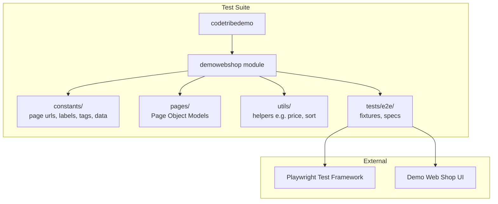
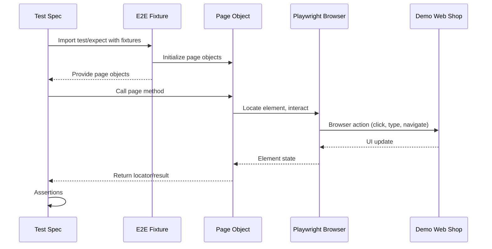

# Architecture

## System Overview

A Playwright + TypeScript **E2E** test suite for the
[Tricentis Demo Web Shop](https://demowebshop.tricentis.com/). It is a single-team,
single-module project supporting parallel test execution and CI integration.
There is no API-testing layer — all tests drive the browser.

## Architecture Diagram



## Component Map

**Single module**: `src/demowebshop/` holds everything for this project.

```
src/demowebshop/
├── constants/
│   ├── demowebshop-page-urls.ts     # route constants (paths relative to BASE_URL)
│   ├── category-constants.ts        # category slugs, tree, sort options
│   ├── search-constants.ts          # search terms + product fixtures
│   ├── tags.ts                      # @sanity / @regression tag strings
│   └── labels/
│       └── demowebshop-labels.ts    # UI text labels
├── pages/
│   ├── search.page.ts               # search results
│   ├── product.page.ts              # product-details page
│   └── category.page.ts             # category listing, pager, sort, nav
├── utils/
│   ├── price.ts                     # price format validation
│   ├── sort.ts                      # sort-order checks
│   ├── report.ts                    # search-results markdown report
│   └── availability.ts             # expected Add-to-Cart state from stock
├── types/
│   └── product-tile.ts             # tile-snapshot shape (ProductTile)
└── tests/
    └── e2e/
        ├── fixtures/                # page-object fixtures
        └── specs/                   # test specs
```

## Main Flow

### E2E Test Flow



## External Dependencies

### Playwright
- **Purpose**: Test runner, browser automation, assertions
- **Configuration**: `playwright.config.ts`

### Demo Web Shop (under test)
- **UI**: navigated via Playwright using `BASE_URL` (defaults to
  `https://demowebshop.tricentis.com`). Routes live in
  `constants/demowebshop-page-urls.ts`.
- **Server-rendered**: nopCommerce HTML with no JSON API and no `data-testid`
  hooks, so page objects rely on semantic roles, ids, and stable class names.

### CI
- **GitHub Actions**: lint + typecheck on every PR (`.github/workflows/CI.yml`),
  with an optional commented step to run the Playwright suite.

## Cross-Cutting Concerns

### Configuration
- **Environment Variables**: `.env` (not committed) — see `.env.example`
- **TypeScript Config**: `tsconfig.json` defines path aliases
- **Playwright Config**: `playwright.config.ts` — behavior, timeouts, retries, browsers

### Import Aliases
- `@tests/*` — Test files
- `@utils/*` — Utility functions
- `@pages/*` — Page Object Models
- `@constants/*` — Configuration constants
- `@typings/*` — Shared type definitions
- `@fixtures/*` — Test fixtures

### Logging and Reporting
- **List Reporter**: per-test console output (local runs)
- **HTML Reporter**: `playwright-report/`
- **Test Results**: `test-results/`
- **Screenshots**: on failure; **Trace/Video**: retained on failure when
  `TRACE_ENABLED` / `RECORDING_ENABLED` are set (configurable)

## Invariants

1. **No Relative Traversal**: use configured aliases
2. **Constants Centralization**: routes, labels, tags, and test data use constants
3. **Type Safety**: avoid `any`; use `unknown` only when a concrete type can't be derived
4. **Test Independence**: no dependence on execution order or shared state
5. **Page Object Encapsulation**: selectors and interactions live in page objects; assertions live in specs
6. **Cleanup Responsibility**: tests clean up any data they create
7. **Generated Artifacts**: never hand-edit `playwright-report/` or `test-results/`

## Extension Points

### Adding a New Page Object
1. Create `pages/<name>.page.ts` with locators and interaction methods
2. Add it to the E2E fixtures (`tests/e2e/fixtures/demowebshop-e2e-fixtures.ts`)
3. Write a spec in `tests/e2e/specs/`

### Adding Routes / Labels
1. Add the route to `constants/demowebshop-page-urls.ts`
2. Add any UI text to `constants/labels/demowebshop-labels.ts`

### Adding a Shared Type
1. Create `types/<name>.ts` with a named `type`/`interface` export
2. Import it via the `@typings/*` alias from pages/specs/utils

## Key Design Decisions

- **Single module** — the project is small (10–20 tests), so one module keeps it simple.
- **E2E only** — no API layer; all verification is through the browser.
- **Absolute imports only** — refactorable, non-brittle paths.
- **Centralized constants** — single source of truth for routes/labels/tags/data.
- **Page Object Model** — encapsulates UI structure, keeps specs assertion-only.
- **Fixture-based setup** — reusable, type-safe dependency injection.

## Links

- **Agent Guide**: [AGENTS.md](AGENTS.md)
- **Commands**: [COMMANDS.md](COMMANDS.md)
- **Security**: [SECURITY.md](SECURITY.md)
- **Testing Guide**: [docs/testing.md](docs/testing.md)
- **Playwright Docs**: https://playwright.dev/docs/intro
